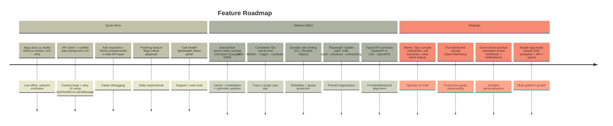

# Roadmap: Feature & Improvement Suggestions (YOU+)

Last updated: 2025-12-12

### Current Architecture Snapshot (what’s already strong)

- **Frontend (`web/`)**: Next.js App Router, Supabase auth (OAuth), Zustand stores, custom `ApiClient` with **timeouts + idempotent retries + token refresh** (`web/src/services/api.ts`).
- **Backend (`backend/`)**: Hono on Cloudflare Workers, **Sentry middleware**, CORS/security middleware, feature routers, and **subscription gating** (`backend/src/middleware/auth.ts`).
- **Jobs & scheduling**:
  - **Trigger.dev** handles onboarding/background processing.
  - **AWS EventBridge + Lambda** triggers per-user daily calls.
- **Observability**:
  - **Sentry**: Next.js + Worker.
  - **PostHog**: centralized analytics service with **PII redaction** + feature flags (`web/src/services/analytics.ts`).

### Where the next leverage is (gaps & opportunities)

- **Data fetching & caching**
  - **Now**: Zustand caching exists for dashboard (~5 minutes) (`web/src/stores/dashboardStore.ts`), but there’s no general request cache/invalidation layer (no `@tanstack/react-query` / SWR).
  - **Opportunity**: standardize a single “server state” approach (Query cache + invalidation + optimistic updates) so every screen doesn’t reinvent loading/error/cache.

- **End-to-end observability**
  - **Now**: Sentry and console logging exist, but logs/events don’t share a consistent **request/run correlation ID** across Next.js → Worker → Trigger.dev → Lambda → Agent.
  - **Opportunity**: propagate `x-request-id` / `traceparent` end-to-end; add Sentry breadcrumbs + PostHog event correlation to make debugging “one user’s day” trivial.

- **Security hardening & auth ergonomics**
  - **Now**: Supabase auth in web; backend checks bearer token and subscription. Frontend also reads data directly from Supabase (RLS must remain tight).
  - **Opportunity**: formalize “sensitive reads/writes go through Worker” vs “safe reads via Supabase”; add automated checks around RLS expectations.

- **Reliability & rate limiting**
  - **Now**: backend has basic in-memory rate limiting (per backend architecture doc) which resets per worker instance.
  - **Opportunity**: move limits to a durable store (Cloudflare KV / Durable Object) and add per-route policies (auth, onboarding, billing, webhooks).

- **Testing & DX**
  - **Now**: Jest/Playwright dependencies exist, but typical flows (auth → checkout → onboarding → schedule) don’t appear to be enforced as an automated suite.
  - **Opportunity**: “golden path” Playwright tests + CI gates; contract tests for backend routes; typed API contracts shared between `backend/` and `web/`.

- **User-facing improvements**
  - **Opportunity**: in-app “Call Health” (did I get called? why not?), pause windows, resilience UX for missed calls, accountability partner notifications, admin/operator console.

---

## Diagram 1: Timeline Overview (phased roadmap)

%% Quick Wins = days to ~1 week; Medium = 1–4 weeks; Strategic = 1–3+ months %%



---

## Diagram 2: Current vs Proposed Flowchart (integration points)

```mermaid
flowchart TB
    subgraph Current["Current Features"]
        direction LR
        WEB[Next.js Web]
        SB[Supabase (Auth + DB)]
        CF[Cloudflare Worker API (Hono)]
        R2[Cloudflare R2]
        TR[Trigger.dev Tasks]
        AWS[AWS EventBridge + Lambda]
        AG[Cartesia Agent]
        PAY[DodoPayments]
        OBS[Observability (Sentry)]
        AN[Analytics/Flags (PostHog)]
    end

    subgraph Proposed["Proposed Features"]
        direction LR
        CACHE[Unified server-state cache\n(TanStack Query/SWR)]
        TRACE[End-to-end correlation IDs\n(traceparent/x-request-id)]
        RL[Durable rate limiting\n(KV/Durable Object)]
        OPS[Ops Console\n(Admin)]
        CONTRACT[Typed API contracts\n(OpenAPI/contract tests)]
        QA[Playwright golden-path CI]
    end

    WEB --> SB
    WEB --> CF
    CF --> SB
    CF --> R2
    TR --> SB
    TR --> R2
    AWS --> CF
    CF --> AG
    WEB --> PAY
    WEB --> AN
    WEB --> OBS
    CF --> OBS

    WEB .-> CACHE
    WEB .-> TRACE
    CF .-> TRACE
    CF .-> RL
    WEB .-> QA
    CF .-> CONTRACT
    SB .-> OPS
    AWS .-> OPS
    TR .-> OPS

    style WEB fill:#F7F7F4,stroke:#D4D4D0
    style SB fill:#F7F7F4,stroke:#D4D4D0
    style CF fill:#F7F7F4,stroke:#D4D4D0
    style R2 fill:#F7F7F4,stroke:#D4D4D0
    style TR fill:#F7F7F4,stroke:#D4D4D0
    style AWS fill:#F7F7F4,stroke:#D4D4D0
    style AG fill:#F7F7F4,stroke:#D4D4D0
    style PAY fill:#F7F7F4,stroke:#D4D4D0
    style OBS fill:#F7F7F4,stroke:#D4D4D0
    style AN fill:#F7F7F4,stroke:#D4D4D0

    style CACHE fill:#FEF0ED,stroke:#F34F1D,stroke-dasharray:5 5
    style TRACE fill:#FEF0ED,stroke:#F34F1D,stroke-dasharray:5 5
    style RL fill:#FEF0ED,stroke:#F34F1D,stroke-dasharray:5 5
    style OPS fill:#FEF0ED,stroke:#F34F1D,stroke-dasharray:5 5
    style CONTRACT fill:#FEF0ED,stroke:#F34F1D,stroke-dasharray:5 5
    style QA fill:#FEF0ED,stroke:#F34F1D,stroke-dasharray:5 5
```

---

## Suggested Backlog (short, actionable)

### Quick Wins

- **Consistency**
  - Update root README to reflect current Next.js version (repo shows `next@16.0.6`).
  - Add a single “Local Dev: ports + services” section (frontend/backends/agent/lambda).

- **Error UX**
  - Standardize a `useApiError()` helper that maps `ApiClientError` to UI copy + retry CTA.

- **Observability glue**
  - Generate a `requestId` per browser session + per API call; attach to:
    - Worker request headers
    - Sentry breadcrumbs
    - PostHog event properties (non-PII)

### Medium Effort

- **Caching layer**
  - Introduce TanStack Query/SWR for Worker API calls.
  - Keep Zustand for UI state; use query cache for server state; invalidate on writes.

- **Contracts**
  - Adopt OpenAPI for Worker endpoints (or derive from Zod schemas) and generate:
    - typed clients for `web/`
    - contract tests for `backend/`

- **Rate limiting**
  - KV/DO-backed rate limiting with per-route quotas and webhook-specific limits.

- **E2E**
  - Playwright tests for:
    - OAuth callback success/failure
    - checkout
    - onboarding submission
    - dashboard load (cached + cold)

### Strategic

- **Ops console**
  - “One user view”: onboarding completeness, voice clone status, schedule, last call outcome, last webhook payloads, recent errors.

- **Distributed tracing**
  - End-to-end traces for “daily call execution” spanning AWS → Worker → Cartesia (+ Trigger.dev where relevant).

---

## Questions (pick priorities)

1. **Primary goal for the next 4 weeks**: revenue conversion, reliability, retention, or onboarding completion?
2. **Where are you feeling the most pain today**: debugging production issues, iteration speed, or user drop-off?
3. **Do you want the web app to rely more on the Worker API vs direct Supabase reads** (to simplify RLS/security)?
4. **Do you want an Ops console now**, or should we prioritize cache + tracing first?


